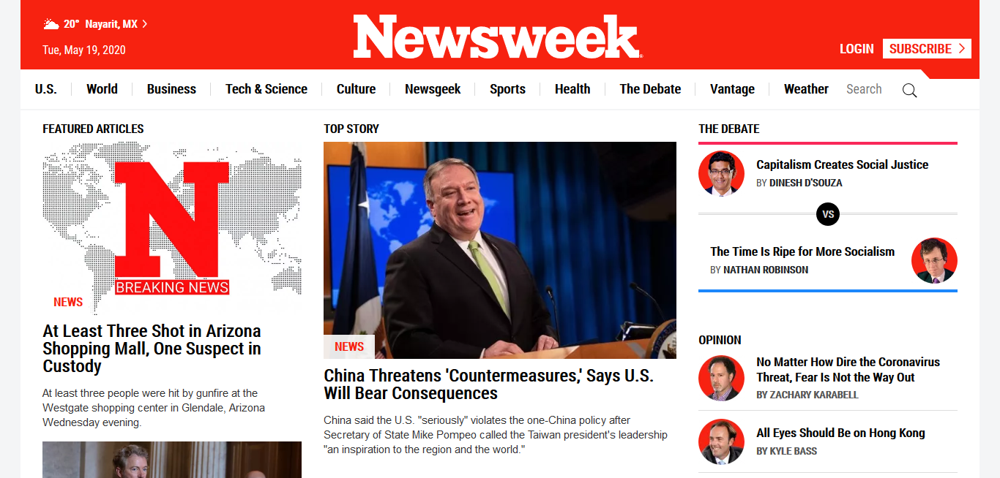

# MC-project7
Using bootstrap

## Microverse HTML/CSS project 7

This project consists of replicating [The Newsweek ](https://www.newsweek.com/) front page layout. (Note: there may be some differences compared to the original as the site keeps updating everyday)

#### I. The project was based on a responsive layout with the next break points:

 - For mobile displays with a screen smaller than 768px.
 - For tablet displays with a screen smaller than 1024 px.
 - For desktop displays with a screen wider than 1024 px.

#### II. The layout was built with HTML and CSS,  focusing on responsiveness and making use of:

 - Flexbox, Grid and floating elements
 - Positioning
 - SVG, png, jpg, and webp images
 - Media queries
 - Bootstrap (no javascript was used )

#### III. The main areas of the project can be divided as follows:

  ###### &nbsp; The header
  Except for the deskto version, it was created to remain fixed on the top of the page and adding elements according to the page width.

  ###### &nbsp; The main content
  It comprises the main layout areas, all of which are organized, aligned and justified within a grid system.

  ###### &nbsp; The footer
  It contains the media links and the copyright notice.

## Built With

- HTML & CSS
- Code Editors- Atom
- Bootstrap 4.4.1

## Live Demo

- [Live Demo Link](https://rawcdn.githack.com/Jhdezj/MC-project7/19778576e30c554746f7843e711fe6f491b896ec/index.html)

## Getting Started

To get a local copy up and running follow these simple example steps.

* #### Prerequisites:
You can use any browser updated to the current version and your regular internet connection.
* #### Setup & install:
Clone or download the project folder using the button on the top right corner of this page.
* #### Usage:
Go to the project folder and open the `index.html` file on your browser.

## Author

👤 **Jorge Hernandez**

- Github: [@Jhdezj](https://github.com/Jhdezj)
